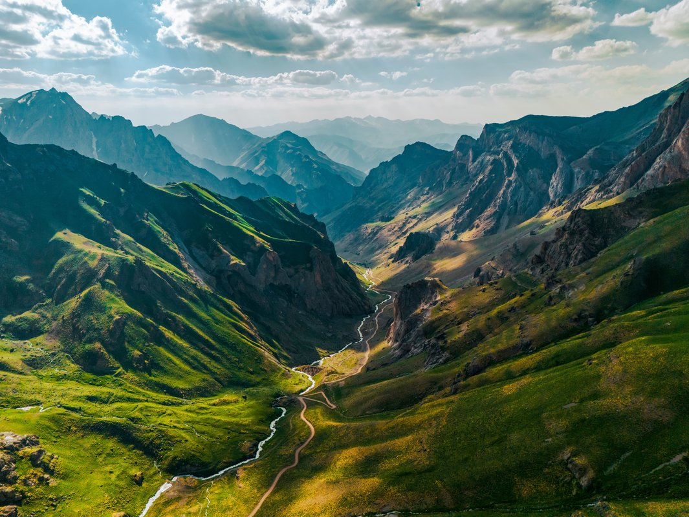

This post lives in a **leaf bundle**: `content/blog/demo-post-1/index.md` plus files in the same folder (for example `cover.svg`). The public URL is **`/blog/demo-post-1/`** from the folder name; you could override that with `slug:` in front matter if you wanted a different last segment.







This paragraph is only for a short automatic summary if you add a `<!--more-->` marker after the intro line in a longer article.

<!--more-->

## haz_img presets

Same file, different keys. Resize the window: 768 and 992 are the BPs.

### As is

Empty `ratio`. File keeps its own shape. No `auto` on `sizes`.





The picture above should look like the photograph, not a 16/9 crop and not 150px tall.

### Full, then half left

100 / 100 / 50, float left. On a phone it is full width; on desktop it sits left and this copy should wrap the right side. Keep dragging the window across 992 to see the jump.





Wrap text for the half-desktop float. If the next block starts beside the picture, the clear below failed. More words so a short window still has something to tuck beside the frame: the kit’s `sizes` string should pick a smaller file when this is only half the column.



### Quarter right

25 / 25 / 25, float right. Small on every band. Copy should run down the left.





This column of words is here so the quarter square has a neighbor. On a narrow phone 25% is a thumbnail; on desktop it stays a thumbnail. That is the point of the test — width does not grow with the column.



### Mid, centered

75 / 50 / 75, no float. `haz_img_center`. Tablet should look narrower than phone or desktop.





Not floated. If it sits on the left edge, the center class missed.

### Half square left (wrap + clear)

Existing starter. 50 / 50 / 50, 1/1, float left.





Square crop, text beside it. The next heading must start below, not in the leftover column.



### Tall frame

3/4 cover, full width. Same landscape file — cover should clip the sides, not squash.





## FPO section heading

1. Categories and tags drive taxonomy pages such as `/categories/notes/` and `/tags/hugo/`.
2. Those lists are generated by Hugo from your front matter, not from a hand-maintained list in the config.
3. The “archive” at `/blog/` is this section’s `_index.md` body plus Hugo’s `.Pages` list (see `layouts/section.html`).
